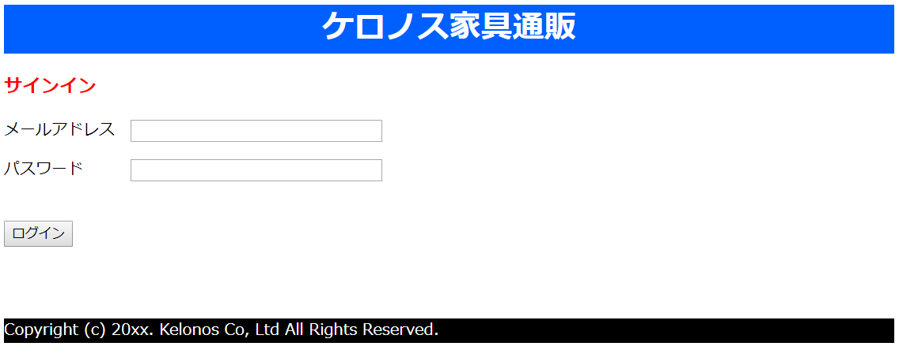

# HTML/CSS 演習問題

### 演習1

HTML/CSSを用いて以下のような画面を作成しなさい。

[解答例](answer/html-css-01.md)

 

### 演習2

HTML/CSSを用いて以下のような画面を作成しなさい。

[解答例](answer/html-css-02.md)

 

### 演習3

HTML/CSSを用いて以下のような画面を作成しなさい。

[解答例](answer/html-css-03.md)

 

### 演習4

HTML/CSSを用いて以下のような画面を作成しなさい。

【使用画像】 
<a href="images/table.png" download="images/table.png">table.png</a> 
<a href="images/desk.png" download="sample.pdf">table.png</a>

[解答例](answer/html-css-04.md)

 

### 演習5

HTML/CSSを用いて以下のような画面を作成しなさい。

【使用画像】 
<a href="images/chair.png" download="images/chair.png">table.png</a> 
<a href="images/bed.png" download="images/bed.png">table.png</a> 
<a href="images/sofa.png" download="images/sofa.png">table.png</a>

[解答例](answer/html-css-05.md)
